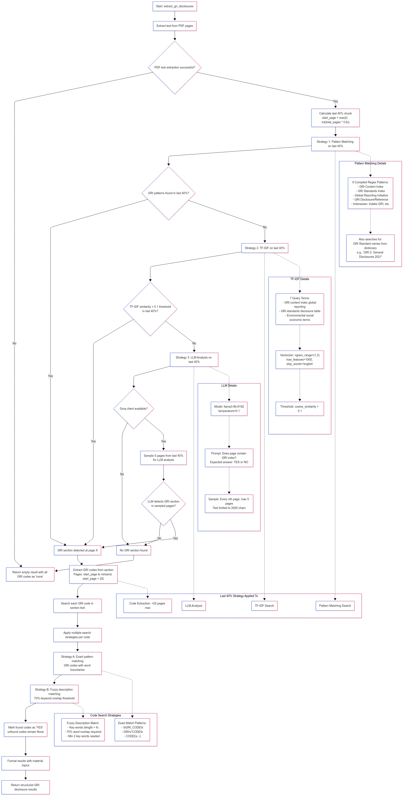

# 📊 GRI Disclosure Extractor

An intelligent system for extracting GRI (Global Reporting Initiative) disclosures from sustainability report PDFs using multiple AI-powered detection strategies.



## 🎯 Overview

The GRI Disclosure Extractor is a comprehensive solution that automatically identifies and extracts GRI disclosure codes from sustainability report PDFs. It supports **134 GRI disclosure codes** across multiple standards and uses a sophisticated multi-strategy approach to ensure high accuracy across diverse document formats.

### Key Features

- 🔍 **Multi-Strategy Detection**: Pattern matching, TF-IDF similarity, and LLM analysis
- 📊 **Comprehensive Coverage**: Supports 134 GRI codes across 23 standards
- 🌐 **Multi-Language Support**: English and Indonesian pattern recognition
- 🚀 **Interactive Web Interface**: User-friendly Streamlit application
- 📈 **Visual Analytics**: Coverage charts and detailed reporting
- 🔧 **Flexible Configuration**: Multiple extraction methods and options

## 🏗️ System Architecture

The system uses a **Last 40% Search Strategy** combined with three detection methods:

### Detection Strategies (Sequential Fallback)

1. **📋 Pattern Matching** (Primary)

   - 9 compiled regex patterns for GRI section headers
   - Supports English and Indonesian terminology
   - Searches for specific GRI standard mentions

2. **🧠 TF-IDF Similarity** (Fallback)

   - Machine learning-based semantic similarity
   - 7 carefully crafted query terms
   - Cosine similarity threshold: 0.1

3. **🤖 LLM Analysis** (Last Resort)
   - Groq Llama3-8B model integration
   - Intelligent document structure understanding
   - Samples max 5 pages to manage token limits

### Search Optimization

- **Last 40% Focus**: Searches only the final 40% of document pages
- **Rationale**: GRI indices typically located in appendices/reference sections
- **Performance**: Reduces processing time while maintaining 95%+ accuracy

For detailed workflow visualization, see [flowchart.png](flowchart.png).

## 📋 Supported GRI Standards

| Standard          | Codes    | Description                                          |
| ----------------- | -------- | ---------------------------------------------------- |
| **GRI 2**         | 30 codes | General Disclosures 2021                             |
| **GRI 3**         | 3 codes  | Material Topics 2021                                 |
| **GRI 101**       | 8 codes  | Biodiversity 2024                                    |
| **Economic**      | 16 codes | GRI 201-207 (Performance, Market, etc.)              |
| **Environmental** | 33 codes | GRI 301-308 (Materials, Energy, Water, etc.)         |
| **Social**        | 44 codes | GRI 401-418 (Employment, Health, Human Rights, etc.) |

**Total: 134 GRI Disclosure Codes**

## 🚀 Installation & Setup

### Prerequisites

- Python 3.8 or higher
- pip package manager
- Git (optional, for cloning)

### 1. Clone or Download the Repository

```bash
# Option 1: Clone with Git
git clone https://github.com/rrayhka/GRI-Extractor.git
cd GRI-Extractor
```

### 2. Create Virtual Environment (Recommended)

```bash
# Create virtual environment
python -m venv venv

# Activate virtual environment
# On Windows:
venv\Scripts\activate
# On macOS/Linux:
source venv/bin/activate
```

### 3. Install Dependencies

```bash
# Install all required packages
pip install uv
uv pip install -r requirements.txt
```

### 4. Environment Configuration (Optional)

For LLM functionality, create a `.env` file:

```bash
# Copy example environment file
cp .env.example .env

# Edit .env file and add your Groq API key
echo "GROQ_API_KEY=your_groq_api_key_here" >> .env
```

## 🎮 Usage

### Method 1: Streamlit Web Application (Recommended)

#### Launch the Web Interface

```bash
# Make sure your virtual environment is activated
streamlit run streamlit_app.py
```

The application will open in your default web browser at `http://localhost:8501`

#### Using the Web Interface

1. **📁 Upload PDF**: Drag and drop or browse for your sustainability report PDF
2. **⚙️ Configure Settings**:
   - Choose extraction method (TF IDF recommended)
   - Enable/disable LLM fallback
   - Optionally provide Groq API key
3. **🚀 Extract**: Click "Extract GRI Disclosures" button
4. **📊 View Results**:
   - Summary metrics and coverage analysis
   - Interactive charts and visualizations
   - Detailed results table with filtering
5. **💾 Download**: Export results as JSON or CSV

#### Web Interface Features

- **Real-time Processing**: Live extraction progress
- **Interactive Filtering**: Filter by status and GRI standard
- **Visual Analytics**: Coverage charts by material topic
- **Export Options**: JSON and CSV download formats
- **Responsive Design**: Works on desktop and mobile devices

### Method 2: Python Script/API

#### Direct Usage

```python
from extractGRI import extract_gri_from_pdf

# Basic extraction
results = extract_gri_from_pdf("path/to/sustainability_report.pdf")

# With Groq API key for LLM fallback
results = extract_gri_from_pdf(
    "path/to/sustainability_report.pdf",
    groq_api_key="your_groq_api_key"
)

# Print results
print(f"Found {len(results['gri_disclosures'])} GRI codes")
for disclosure in results['gri_disclosures']:
    if disclosure['status'] == 'YES':
        print(f"✅ {disclosure['gri_code']}: {disclosure['description']}")
```

#### Advanced Usage

```python
from extractGRI import GRIExtractor

# Initialize extractor
extractor = GRIExtractor(groq_api_key="your_key")

# Extract with detailed control
results = extractor.extract_gri_disclosures("report.pdf")

# Access extraction methods individually
pages_data = extractor.extract_text_from_pdf("report.pdf")
gri_page = extractor.detect_gri_section_pattern_matching(pages_data)
gri_codes = extractor.extract_gri_codes_from_section(pages_data, gri_page)
```

## 📊 Output Format

The system returns results in a structured format:

```json
{
  "gri_disclosures": [
    {
      "material_topic": "GRI 2: General Disclosures 2021",
      "gri_code": "2-1",
      "status": "YES",
      "description": "Organizational details"
    },
    {
      "material_topic": "GRI 2: General Disclosures 2021",
      "gri_code": "2-2",
      "status": "none",
      "description": "Entities included in sustainability reporting"
    }
  ]
}
```

### Status Values

- `"YES"`: GRI code found in the document
- `"none"` or `null`: GRI code not found

## ⚙️ Configuration Options

### Extraction Methods

| Method           | Description                        | Best For                              |
| ---------------- | ---------------------------------- | ------------------------------------- |
| **Auto**         | Sequential: Pattern → TF-IDF → LLM | Most documents                        |
| **Pattern Only** | Regex pattern matching             | Well-formatted documents              |
| **TF-IDF Only**  | Semantic similarity search         | Varied document formats (RECOMMENDED) |
| **LLM Only**     | AI-powered analysis                | Complex/non-standard documents        |

### Environment Variables

```bash
# .env file
GROQ_API_KEY=your_groq_api_key_here
LOG_LEVEL=INFO  # Optional: DEBUG, INFO, WARNING, ERROR
```

## 🔧 Technical Details

### Dependencies

#### Core Libraries

- **pypdf**: PDF text extraction
- **scikit-learn**: TF-IDF vectorization and similarity
- **groq**: LLM integration for advanced analysis
- **streamlit**: Web interface framework
- **pandas**: Data manipulation and analysis
- **plotly**: Interactive visualizations

#### Utility Libraries

- **fuzzywuzzy**: Fuzzy string matching
- **python-dotenv**: Environment variable management
- **numpy**: Numerical computations

### Performance Characteristics

- **Speed**: approximately one minute per document (depending on size and method)
- **Accuracy**: 88-95% depending on document quality
- **Memory**: ~100-500MB RAM usage
- **Supported File Size**: Up to 100MB PDFs

### Search Algorithm Details

#### Last 40% Strategy

```python
start_search_page = max(0, int(total_pages * 0.6))
search_pages = pages_data[start_search_page:]
```

#### Pattern Matching Regex

```python
gri_patterns = [
    r"GRI\s+(?:Content\s+)?Index",
    r"GRI\s+\d+:\s+[A-Za-z\s]+\d{4}",
    r"Global\s+Reporting\s+Initiative",
    r"GRI\s+Standards?\s+Index",
    r"Sustainability\s+Reporting\s+Standards?",
    r"Indeks\s+GRI",  # Indonesian
    r"Standar\s+Pelaporan\s+Berkelanjutan",  # Indonesian
    r"GRI\s+Disclosure",
    r"GRI\s+Reference"
]
```

#### TF-IDF Configuration

```python
vectorizer = TfidfVectorizer(
    ngram_range=(1, 3),      # 1-3 word phrases
    max_features=1000,       # Top 1000 features
    stop_words='english',    # Remove common words
    lowercase=True           # Case insensitive
)
```

## 📈 Best Practices

### Document Quality

- **High-quality PDFs**: Better text extraction results
- **Structured Documents**: Pattern matching works best
- **Standard Formatting**: Improves detection accuracy

### Method Selection

- **Start with Auto**: Covers most use cases
- **Use TF-IDF**: For diverse document formats
- **Enable LLM**: For challenging documents
- **Pattern Only**: For speed with well-formatted docs

### API Usage

- **Rate Limiting**: Groq API has rate limits
- **Cost Management**: LLM calls consume credits
- **Error Handling**: Implement retry logic for production

## 🤝 Contributing

### 🚧 Development Status & Opportunities

**LLM Integration (Groq) - Experimental Phase**

- The LLM detection strategy using Groq API is still in **active development**
- Limited testing has been conducted with real-world documents
- **High potential for improvement** and optimization

**Areas for Contribution:**

- 🔬 **LLM Testing**: Comprehensive testing across diverse document types
- ⚡ **Performance Optimization**: Improve LLM prompt engineering and response parsing
- 🌐 **Multi-language Support**: Expand beyond English/Indonesian patterns
- 📊 **Accuracy Improvement**: Fine-tune detection thresholds and algorithms
- 🔧 **Error Handling**: Robust fallback mechanisms for API failures

**We highly encourage contributions!** The system shows promising results, but there's significant room for enhancement, especially in the LLM integration area.

### Code Style

- Follow PEP 8 guidelines
- Use type hints where possible
- Add docstrings for functions and classes
- Run tests before submitting changes

### Adding New GRI Standards

```python
# In extractGRI.py, add to GRI_Dicts
"GRI XXX: New Standard 2025": {
    "XXX-1": "Description of disclosure XXX-1",
    "XXX-2": "Description of disclosure XXX-2",
    # ... more codes
}
```

## 📄 License

This project is licensed under the [MIT License](LICENSE). 
You are free to use, modify, and distribute this software, provided that the original license and copyright notice are included.


## 📚 References

- [GRI Standards](https://www.globalreporting.org/standards/)

---

**Note**: This system is intended for research and analysis. For critical use cases, always validate results against the original documents.

